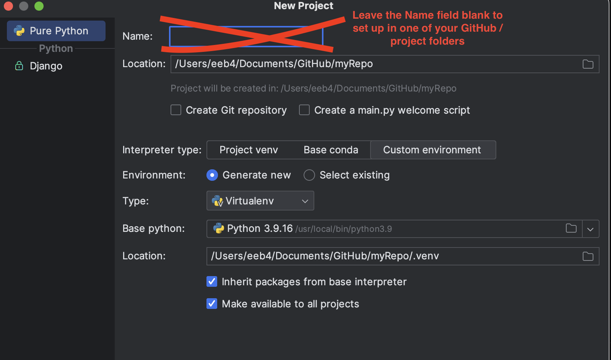
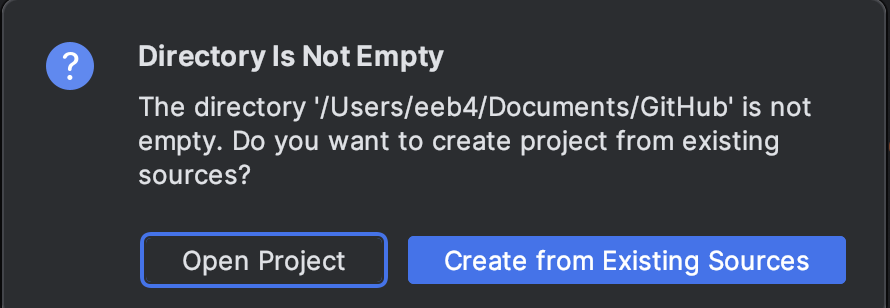

# Python Orientation for Natural Language Processing (NLP) 

The Python programming language is among the most popular ways to access packages or libraries for natural language processing (NLP). We are accessing Python together with the XML stack to  do some powerful text analysis. In our introduction to Python with NLP, we'll explore and experiment to see what we can see about project texts. The Python programming language lets us work with NLP libraries, like NLTK and Spacy, to assist with retrieving data meaningful units of language, like sentences, words, word-stems, punctuation, and other patterns (such as those you could define with regular expressions). 

NLP libraries represent the cumulative work of decades of computational linguistics, which apply statistics to predict the most likely parts of speech of particular words, draw on information to identify the base word forms (or lemmas) of words in a document, and identify patterned language like proper names in text documents and collections. They are also the groundwork for today's <q>AI</q> generative language models

## Stage 1: Prepare a special directory on your personal GitHub repo and some text files to experiment with
* First, add, commit, and push [the .gitignore file from the textAnalysis-Hub or your Project repo](https://github.com/newtfire/textAnalysis-Hub/blob/main/.gitignore). NOTE: This is a system "dot-file", and starts with a dot `.`: `.gitignore`. Setting your .gitignore in place is important because it screens out local installation / system files specific to your computer and allows you to share Python projects with peers and your prof working on different computers (across platforms). 

* Now, create a directory in your personal GitHub repo for Python project work with natural language processing. (You could name the directory `python-nlp` or something simple and clear for you.)

* In it, save some "plain" text files, saved with the `.txt` extension. If you need some text files to start with, copy some over from our [Class Examples/Python folder](https://github.com/newtfire/textAnalysis-Hub/tree/main/Class-Examples/Python) on the textAnalysis-Hub. 


## Stage 2: Start a new project in Pycharm in your new Python directory
* In PycharmCE, go to File >> New Project. Pause carefully on the configuration screen for your project.
* **Do NOT give your project a name, because it will create a new folder**, and you want to set it up in one of your existing GitHub folders.
* Browse to your local GitHub directory and select it as the **location** of your new project at the top of the screen. Here's an image of how to set up the New Project screen: 


* (Your version of Python 3 is probably different from mine, just make sure it's above 3.)

* If your GitHub repo has files and folders in it, when you go to create the Project, you should see this screen: 


* Choose Interpreter Type: Project venv, and this will create a Virtual Environment for Python (venv) in your personal GitHub repo.


### Activate the Virtual Environment (venv) in your repo and install the NLTK library for NLP
As you are starting a new project in Pycharm, 
    * You may be prompted to open a starter "main.py" file, and you may do this if you wish (it's just a starter file: you can delete its contents and write your own code or adapt ours.)
    * You may also just create a new Python file by going to File >> New and selecting Python file. 
* [Our Python sample files](https://github.com/newtfire/textAnalysis-Hub/blob/main/Class-Examples/Python/) are stored on the textAnalysis-Hub in Class Examples >> Python. 
     * The best way to work with these files? **Read them in the web browser and work with them in your own new Python file** so you can adapt them to your files. 

Since this is (very likely) the first time you've worked with NLTK, you will need to install it before it can be available to work with in your Python program. 

 
##### Install at command line in your virtual environment:
   * We will need to activate the **local virtual environment (venv)** that Pycharm configured for your nlp project. 
        1. In Pycharm, open up your project, and open a Python script you've saved in your project directory. 
        2. Run the script, and click the wrench icon on the left-hand side of the Results window (you don't have to wait for the script to complete).
        3. You'll see a Configuration Screen: Look for the **Python Interpreter** line and copy down its filepath. This is where Pycharm is finding Python3 to run on your computer. 
        4. On your shell (Git Bash or Windows): use `cd` to navigate to that filepath you copied down. Use `ls` to look for a folder (either Scripts or bin) that contains activate scripts. You should see several files named `activate`, `activate.ps1`, `activate_this.py`, and more. 
        5. Use `cd ..` to navigate up so you are positioned in the folder *above* the folder that contains the activate scripts. When you type `ls` you should see either the `bin` or `Scripts` folder (which contains the activate scripts).
        6. Type `source Scripts/activate` or `source bin/activate` (depending on which directory you have).
        7. If your command is successful, you will simply see `venv` or `(venv)` appear on your screen as the next line. Congratulations! You have activated your virtual environment!
        8. Now, you can use **Pycharm's Terminal or your own shell** and run the pip installation scripts:

```
pip install nltk
```

[Resource to consult in case of issues with virtual environments or pip](https://docs.python-guide.org/dev/virtualenvs/).


## Write some Python code with NLTK:
* Start NLTK book's very first chapter as a "smoke test" and to get you started with your first Python program. Read [the NLTK Book Preface](https://www.nltk.org/book/ch00.html) up to the Python 3 and NLTK heading. 
* Try writing your first Python program in Pycharm based on the text file you saved in your GitHub repo. Adapt the code in the code block in the "Why Python" seciton. See if it works "out of the box". (Even if it does not, save your code and push to your GitHub repo, and submit it as this first assignment.) 


