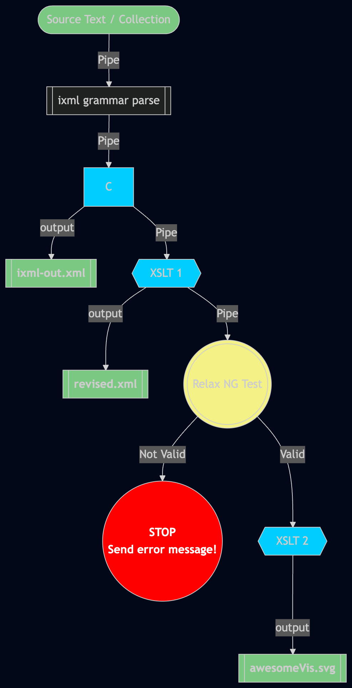

# XProc Pipelining Tutorial
*by Elisa Beshero-Bondar for the Penn State Behrend Digit Program*

<h2>The Big Picture: Pipelines for Projects </h2>
<p>Pipelines in processing text / media are all about scripting changes in stages that you define. XProc gives us a method to do this with "XML stack" technologies for transforming text and checking outputs. </p>

<p> XProc pipeline files are saved with the extension <strong><code>.xpl</code></strong>.</p>

<p>We usually apply XProc to script a pipeline of processes that take an input file (or collection of input files), runs it through a series of processes and produces one or more outputs at each stage. Here's an example of a fairly detailed pipeline of processes to support  that we can script with XProc and run with Calabash or Morgana.
</p>


<section class="flex" style="display:flex;justify-content:space-around">
<figure class="samplePipeline" style="flex:1">

<figcaption style="font-style:italic">Diagram of a sample XProc pipeline process that starts wtih plain text, applies invisible XML, XSLT, and Relax NG validation, and produces multiple outputs in .xml and .svg</figcaption>
</figure>


<div class="samplePipeline" style="flex:1">

<ul>
    <li><strong>Start</strong> by identifying a source text file (or collection of texts) to take as the beginning input.
 </li>
 <li><strong>Pipe</strong> that source into parsing with an invisible XML grammar file.</li>
<li><strong>Store</strong> the output of the grammar (in memory or saved on your computer as an output stage).
</li>
<li><strong>Pipe</strong> that output to XSLT to make changes, add more markup by processing regular expressions with <code>&lt;xsl:analyze-string&gt;</code> .</li>
<li><strong>Store</strong> the output of XSLT (in memory or saved on your computer as an output stage).</li>
<li> <strong>Pipe</strong> that output to <strong>test</strong> it with a Relax NG schema validation step and let you know if it's valid to your project schema.
   <ul>
        <li><strong>If the XML is NOT valid to the schema: stop and output an error message</strong> identifying what's wrong with the XML.
        </li>
   	<li><strong>If the XML is valid to the schema</strong>:
   	    <ul>
   	       <li><strong>Pipe</strong> it to a second XSLT file to output an SVG visualization.</li>
   	       <li><strong>Store</strong> the SVG directly (perhaps to a web-publishing directory to publish on a website).
   	   </ul>
   	</li>
   </ul>
</li>
</ul>
<p>A pipeline like this requires a lot of preparation! Each of those stages requires some work to prepare individually, and assembling them into a pipeline makes it easy to update your source files, make changes at some stage of the process, and quickly run Calabash or Morgana to see the results. </p>
</section>

<h3>Outputs of XProc are usually...</h3>
<ul>
<li>...messages that you deliver to let you know if there's an error or that a stage in the pipeline finished processing,</li>
<li>...storage of files in progress (if you wish), and/or</li>
<li>...storage of output files to directories as end-points.</li>
</ul>

<p>Pipelines can branch and sprout, depending on what you want to script, or they can  just be a straight line!</p>
</div>


## Learning how to script a pipeline

We'll eventually ask you to construct a pipeline as part of your project, so it will help to study how a pipeline is written, and then try to make a simple pipeline of your own based on our work in the Digit 210 class so far. It will help to study some complete pipelines for projects.

The example code we provide below comes from the [Onepiece project](https://github.com/sam-seb/op-sbs) from Spring 2025. You can study the pipeline files and their stored outputs on our class GitHub at <https://github.com/newtfire/textAnalysis-Hub/tree/main/Class-Examples/xproc/onepiece-project>.  The Onepiece project prepared two XProc files:

1. The [first XProc](https://github.com/newtfire/textAnalysis-Hub/tree/main/Class-Examples/xproc/onepiece-project/onepiece-pipeline.xml) took **a single text file** input and output single files.
2. The [second XProc](https://github.com/newtfire/textAnalysis-Hub/tree/main/Class-Examples/xproc/onepiece-project/onepieceColl-pipeline.xpl) **processes a collection** of text files in a directory and outputs a new directory of similarly named output files.

### Running a pipeline (.xpl) file
**Run your pipeline frequently, as you write each new stage!**  Read the output in your shell carefully watching for error messages and try to debug as you go. You can explore and test by running your pipelines on your system with Calabash or Morgana. (If you want to make changes to these files, please check out your own branch or copy and move the files outside our class GitHub repo.) To run a pipeline with Calabash: 

```shell
calabash yourPipeline.xpl 
```

### Writing pipeline stages

### The whole document 
(root element)

### Taking input 

#### Single file

#### Multiple files 

for-each


### Steps for a Project Pipeline
Each of these has something of its own syntax.

#### Processing invisible xml

```xml
<p:invisible-xml cx:processor="markup-blitz">
        <!--ebb: As of now (version 28) oXygen will flag <p:invisible-xml> as an error. 
            Don't worry. It's not!  -->
        <p:with-input port="grammar">
            <p:document href="ebb-ZoomTranscript.ixml" content-type="text/plain"/>
        </p:with-input>
    </p:invisible-xml>
```

#### XSLT


#### XQuery


#### Native XProc Processing Options
SUMMARIZE AND LINK TO KRAETKE'S TUTORIAL

____

#### Validating with Relax-NG
LINK TO RELAX NG TUTORIAL 

#### Validating with Schematron
LINK TO SCHEMATRON TUTORIAL


### Storing in memory

### Outputting a message in the shell when a stage is completed

### Outputting a file / collection of files

#### Single ouput file

#### Multiple output files

Important to figure out your output filenames: make a variable! 


