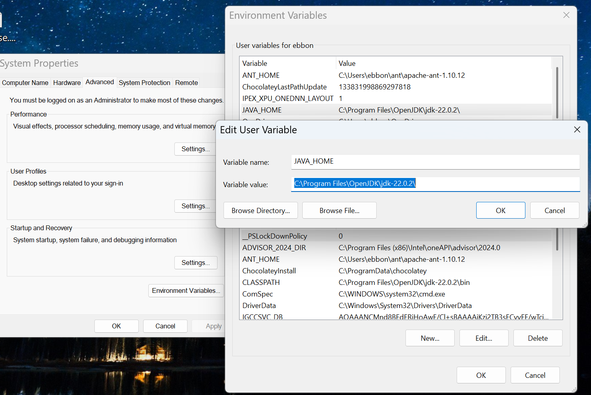

# Installing Chocolatey and OpenJDK (Windows)

On Windows, you will need to move between different shells to handle installations. You will get to know:

* Windows Power Shell, Run in Administrator mode

* Git Bash Shell (where you use git commands / interface with GitHub)

You will also need to: 

* have a `.bashrc` file for storing aliases. An alias is a short word / phrase you can type in your shell to stand in for longer commands, and it will make it easy to run the programs we're installing.

* find and edit your system PATH variables. Some of this can be done in your Control Panel. 

## Install Chocolatey!


=First, we'll install the chocolatey package manager for Windows
Use your Windows PowerShell in "Run as Administrator" mode, and follow [Chocolatey's installation instructions](https://chocolatey.org/install)).

Here's [a friendly YouTube video guide to chocolatey](https://www.youtube.com/watch?v=hfgZYpo5moA) for more info on what chocolatey is for and how to install it. 

You can quickly test out your new installation of Chocolatey by installling Marktext, popular free markdown editor for Windows (which I'm using to write up this guide). Try the command `choco install marktext` You should see the new software come up in your taskbar and you can try it out!

## Installing JDK 
First, make sure you have developer (jdk) java installed:

* To check if you have java, you can use your Git Bash shell to enter `which java` or `where java`(Those commands won't work in PowerShell, but all the shells will respond to `java -version` (which tells you if you have an old version or nothing at all.)
  * Dr. B here: My version was Java 19 (from 2022) on my Lenovo laptop. For the invisible XML / XProc work we're doing here, I'm going ahead and installing the latest easily available OpenJDK developer version for Windows.
* Most likely you need JDK java. We'll use chocolatey to install it. Open your PowerShell (running as Administrator) and enter:

```shell
choco install openjdk
```

  (When doing all these shell installations be sure you read the responses and enter "Y" as needed to continue processes.)

* Now when you check your `java -version` you should see the current JDK that you installed with chocolatey.

* Next we need to make sure the location of the JDK you installed is set in your system environment variables. In your Search bar, look for System or Control Panel (or Edit the System Environment Variables). Find the tab to edit the Environment Variables and look for JAVA_HOME. Click Edit User Variable and paste in the new filepath of your Java. (Find that in Git Bash with `where java`)
  
  