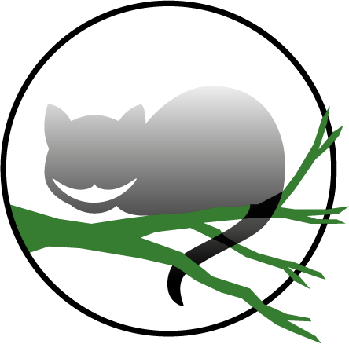

# Invisible XML (ixml) & XProc Setup Guides

  <!--
  -->&nbsp;&nbsp;&nbsp;&nbsp;&nbsp;&nbsp;&nbsp;&nbsp;&nbsp;<!--
  -->

This directory contains step-by-step installation and configuration guides for setting up **[Invisible XML (ixml)](https://invisiblexml.org/)** and **[XProc](https://xproc.org/)** tools for course tutorials and hands-on XML processing work.

These guides walk you through installing:

- Invisible XML processors (CoffeePot, Markup Blitz)
- XProc processors (Calabash, Morgana)
- Required dependencies (OpenJDK, Graphviz, package managers)
- Helpful shell aliases and smoke tests

## Files in This Directory

- **[macOS Setup Guide](https://github.com/newtfire/textAnalysis-Hub/blob/main/Installations/ixml-xproc-InstallNotes-Mac.md)**: Full installation instructions for macOS users

- **[Windows Setup Guide](https://github.com/newtfire/textAnalysis-Hub/blob/main/Installations/ixml-xproc-InstallNotes-Win.md)**: The same instructions, adapted for Windows environments

Both guides are based on the official NineML and XProc documentation and support the Invisible XML + XProc tutorial materials developed by David Birnbaum in Spring 2025.

## Who This Is For

This setup is intended for:

- Students working with Invisible XML and XProc pipelines  
- Digital humanities / XML coursework 
- Anyone experimenting with grammar-based parsing and XML pipelines

## How to Use

1. Open the guide that matches your operating system.
2. Follow the steps in order (don’t skip the smoke tests!).
3. Keep all tools in one place (recommended: your GitHub directory).
4. Use the same aliases provided in the guide for consistency in class.

***

# Python 3.12 + VS Code Setup Guide  
_Updated for Spring 2026_

This directory contains step-by-step installation and configuration instructions for setting up Python 3.12 and Visual Studio Code for coursework involving Natural Language Processing and XML processing.

This guide walks you through installing:

- Python 3.12 (via package managers)
- VS Code and required extensions (Python, Pylance)
- Virtual environments for project isolation
- pip package manager usage and verification
- Helpful commands and smoke tests

## File in This Directory

- **[Python 3.12 + VS Code](https://github.com/newtfire/textAnalysis-Hub/blob/main/Installations/Python_VSCode.md)**: Instructions for both macOS and Windows users installing Python & VS Code, creating virtual environments, and smoke testing their work.

## Who This Is For

This setup is intended for:

- Students working with Python for NLP and XML processing
- Digital humanities / XML coursework 
- Anyone using libraries like NLTK, spaCy, or SaxonC (saxonche)

## How to Use

1. Follow the instructions for your operating system.
2. Complete each step in order (don’t skip the smoke tests!).
3. Keep all tools in one place (recommended: your GitHub directory).
4. Use the same commands and workflows provided for consistency in class.
