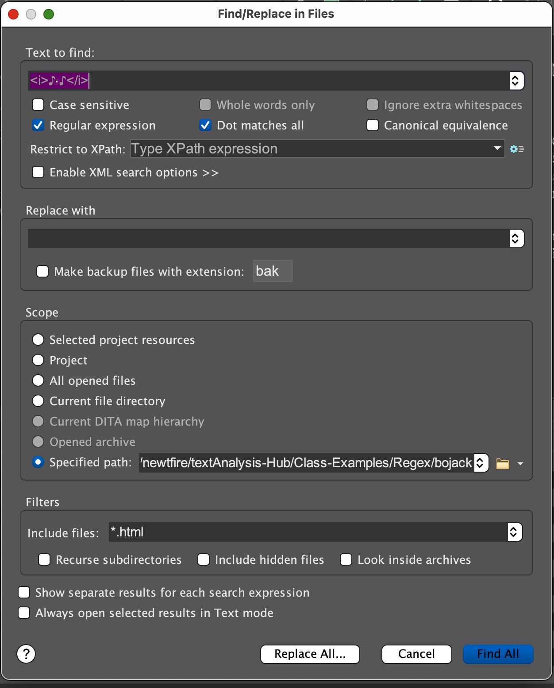
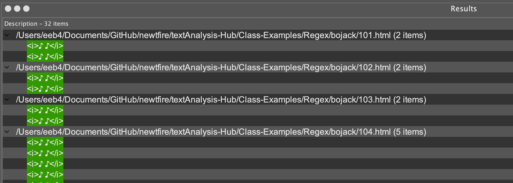

## Regex Exercise: Bojack Horseman or your own project collection

This exercise is designed to familiarize you with regex Find and Replaced operations over a collection of files. We'll be continuing to work with the oXygen XML Editor to help us view matches before we replace. It's also possible to do regular expression match and replace operations using programming code such as Python's re library or XSLT's analyze-string, and we can explore that in your projects if you like. We find oXygen especially helpful for seeing matches as you're testing regular expressions.

### Working with oXygen's Find/Replace in Files
To this point, we have been working with one file at a time, using the Find/Replace window. For working with a collection of files, go to the Find menu and familiarize yourself with Find/Replace in files. The options are different here. 



At the top, mark the Regular expression option and decide whether you want to select Dot matches all. (We have it marked in the screen capture, but remember, you should only mark it when you want to the dot to match over every character including return characters in all the lines within a document.) 

For Find/Replace in files, we set a scope to a Specified path, and here you can click the folder to browse to the directory you are working with. 

Try out a Find in the window for a pattern you know you will see in your collection to get started and make sure everything is working, and see how oXygen's Results window displays returns for particular files. Here is a sample view of the return window for the search featured above, seeking representations of musical passages in the Bojack Horseman HTML subtitles files. You can scroll through results by file here, and select a result to view it in its file. Try clicking on a result to open the file and see it highlighted in context. 




### Your Assignment

For this assignment, you may work with a directory of Bojack Horseman HTML files I have scraped from their source at <https://queerworm.github.io/transcripts/>, or you may work with a collection of files that you have collected for your project.

Your task is analyze your documents carefully and first make a plan for the information structure you wish to create with them for XML. You may wish to work over one or two representative files first with the original Find /Replace window first to assist with your preliminary document analysis. 

The Bojack Horseman scripts are in our class textAnalysis-Hub (main branch) at [textAnalysis-Hub/Class-Examples/Regex/bojack/](https://github.com/newtfire/textAnalysis-Hub/tree/main/Class-Examples/Regex/bojack). Do a `git pull` to pick those up and transfer them to your own workspace for this assignment. Note that these are HTML files. (Previously we've been working with "plain text" files for regex, but if your files are in HTML format, you can easily work with them to convert them to informational XML for analysis, just by making use of the tags you see and converting them as needed.

1. Save an **extra copy** of your collection directory that you don't do regex operations over in case you need to start over. Open a text or markdown "step file" for this assignment (and/or for your project), and start by identifying patterns that matter and kinds of information you're seeing. For example, in the Bojack Horseman files, we see:

```
<i>♪ ♪</i
```
is a pattern for indicating music playing. 

If working with Bojack Horseman, try looking at 104.html for some representative patterns. Jot these down.

2. Remove extra hard returns and spacing and do some basic clean-up as needed. And inspect your documents carefully: Do you find sections in the documents you can partially remove and simplify (such as HTML headings)? Remember, our goal isn't to display your source documents but to create information resources out of them. So for Bojack, perhaps you want to keep the `<title>` element and its contents but remove the extra HTML head element info, the docType declaration, and change the root element to XML. 

Experiment with find and replace operations that help convert your documents to informational XML and record your steps.

3. If working with the Bojack Horseman files, what different kinds of information can you find marked, and what patterns are used (building on our music passage)? Consider:
     * Do you want to keep the timestamp information or alter it for XML storage? 
     * What kinds of information is stored in literal square brackets `[ ]`? Remember, to search for square brackets, parentheses, or curly braces with regular expressions you must escape them, like this `\[` and `\]` sp regex searches for them as literal characters, not as regex reserved symbols. 
     * What is `{\an8}` used for in the Bojack documents? (I tried Google searching this and learned some things about subtitle cues.) Is it significant? If so, preserve it in markup. Example: 

```
     {\an8}You {\an8}You get that? Long face.
     
     Horses have long faces.
```     


In the Bojack scripts, what cues do you see for changes of speaker? In the Bojack script, we can sometimes see a quick conversational exchange between characters stored inside a single set of `<p>` tags. Do you ever see character names identified? Come up with a way to search and replace these that nests speaker information inside a speech element of some kind / in some way that's useful for storing related information together. (Can you store the speaker name in a attribute value, or as a nested element inside a speech?) 
     
4. As you do Find/Replace in Files, oXygen will want you to indicate whether you want to store backup files. Don't worry about this (see step 1). Perform your search and replace operations on the collection, and record your steps in your step file. Push your converted files to your personal (or project) GitHub repo (check with your team about this if working on team files). Convert your collection to well-formed XML that stores relevant information about your documents in XML elements.  


5. You will not be able to save the files to .xml as you convert them because Find/Replace in Files does not work the same way as simple Find/Replace in one file alone. How do you change the file extensions for all the files in the directory? There are lots of ways to do this depending on your operating system, but here is one that works the same way for Mac or Linux Terminal and Windows (Git Bash Shell).
* Open your Git Bash / Terminal shell and navigate to the file directory, and then give this command:

```
        for f in *.html; do mv $f `basename $f .html`.xml; done;
```

That is a Linux-style shell command for renaming files, and it uses a for-loop like what you’ve seen in Python.
    
 6. Push your altered file directory and your markdwon file to your repo. **What to submit on Canvas**: Your step file, and link to your new autotagged collection in your GitHub repo. 


