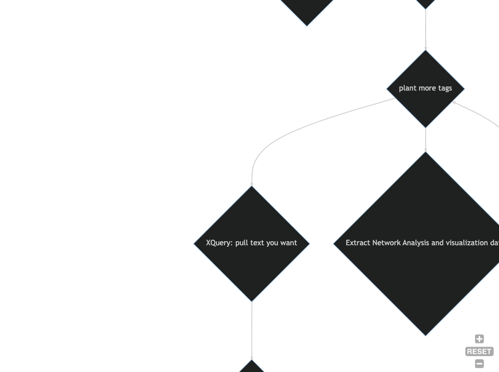

# Workflow for Several Projects

[](https://mermaid.live/edit#pako:eNpVkV9v2jAUxb_KlZ82KaDwN4kfJrWDQidKWeEBbdmDl1zAamJHznVJmvLdawKrOvvF8jn-nXuvG5boFBlnu0wfk4MwBJtJrMCtm98brAh2MsPyT6fz7S3JUChMwRYgVAoGlcgxfYPbLyVp4wSpYCZpbv9-vRBuwT2D783KYInmBaHU1iR4QXLoUkWnz85J84R7rByJNGwfFldx0orTpsiEIshdFJDYl1d12qp3zfanRVNzKGyWAZ0rr7WFo3tyNd61xlmzqumgFSwXKw7L6ZMHq8e1B0jJ1TdrffPm0VJhCTJZEuidK1qlUn3EzlvX_T-aNrBdLzYcHkTxYXUD-a-R-0sjn-v-0UwrMiIhWCIdtXmGGyWyupRlO-MXWVqRyVdB0oWkgoRDXTbzWI4mFzJ1v9ecmTGjA-YYM-6OqTDPMYvVyfmEJb2uVcI4GYses4Uj4USKvRE54zuRle62EIrxhlWMD0K_2xtHQRAOx73ecDQaeqxmvDMYDbvBYOwHUT8Mg2gQnjz2qrVD9LuDaNz3o17gjwI_9Ict7lernTNP7ycCwLg)

[Mermaid](https://mermaid.live/): to make markdown flowcharts like this

Exported image of flowchart: (best to preserve on the local repo in case Mermaid goes away.)

[]
[]
