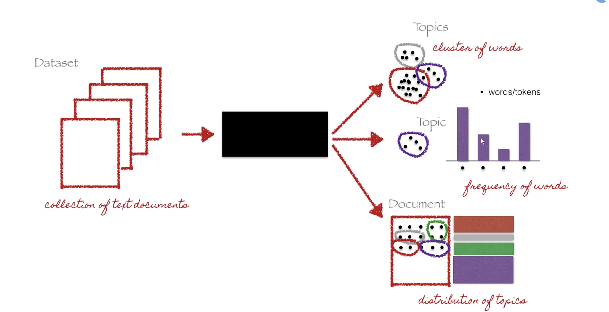

# LDA Topic Modeling Resources

An overview of the process as it locates topic words in documents:

Retrieved from an [LDA Topic Modeling video on YouTube](https://www.youtube.com/watch?v=pZgYRYUc6Mc) working with different imports/packages than we are.

Selva Prabhakaran's pair of tutorials: 
* [Topic Modeling with Gensim (Python)](https://www.machinelearningplus.com/nlp/topic-modeling-gensim-python/): walks through the process with 20-newsgroups JSON dataset. Applies bigrams and trigrams to find phrases to add to the model. Shows coherence testing to help find ideal number of topics. Shows topic distributions across "documents" in a chart.
* [Topic modeling visualization – How to present the results of LDA models?](https://www.machinelearningplus.com/nlp/topic-modeling-visualization-how-to-present-results-lda-models/)

[Author-topic modeling example](https://github.com/RaRe-Technologies/gensim/blob/develop/docs/notebooks/atmodel_tutorial.ipynb) works with document collection with author and year information. Works author data into the model: Which authors are associated most with specific topics? 

